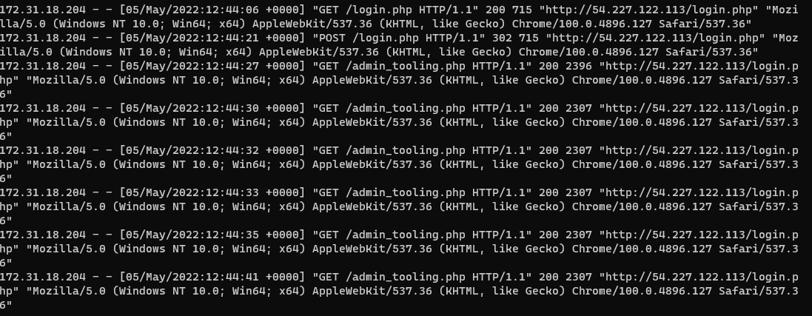
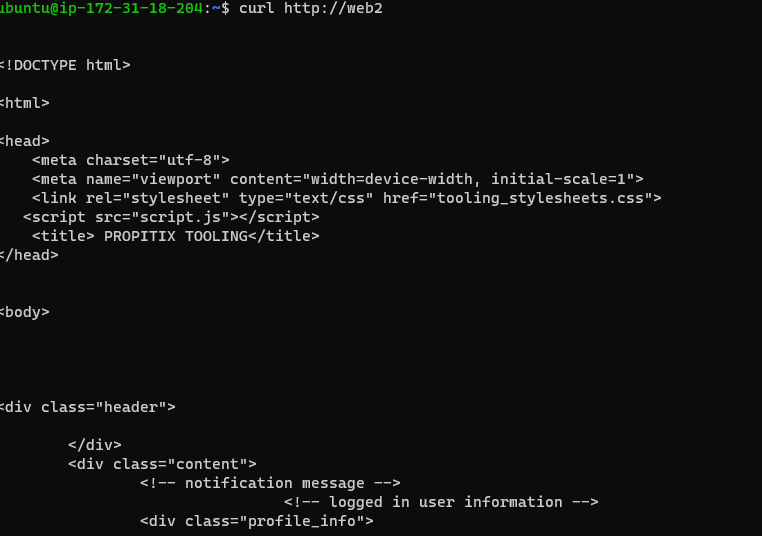

# LOAD BALANCER SOLUTION WITH APACHE
> Create an Ubuntu Server 20.04 EC2 instance and name it Project-8-apache-lb
Open TCP port 80 on Project-8-apache-lb
> Install Apache Load Balancer on Project-8-apache-lb server and configure it to point traffic coming to LB to both Web Servers
```
 sudo apt update -y
sudo apt install apache2 -y
sudo apt-get install libxml2-dev
sudo a2enmod rewrite
sudo a2enmod proxy
sudo a2enmod proxy_balancer
sudo a2enmod proxy_http
sudo a2enmod headers
sudo a2enmod lbmethod_bytraffic
sudo systemctl restart apache2
sudo systemctl status apache2
```
> Configure load balancing
```
sudo vi /etc/apache2/sites-available/000-default.conf
```
> Insert the following code into the conf file

<Proxy "balancer://mycluster">
               BalancerMember http://<WebServer1-Private-IP-Address>:80 loadfactor=5 timeout=1
               BalancerMember http://<WebServer2-Private-IP-Address>:80 loadfactor=5 timeout=1
               ProxySet lbmethod=bytraffic
               # ProxySet lbmethod=byrequests
        </Proxy>

        ProxyPreserveHost On
        ProxyPass / balancer://mycluster/
        ProxyPassReverse / balancer://mycluster/
sudo systemctl restart apache2

> Verify that our configuration works – try to access your LB’s public IP address or Public DNS name from your browser:
http://<Load-Balancer-Public-IP-Address-or-Public-DNS-Name>/index.php
> you should get the following results


> Access the servers logs by running the following command

`sudo tail -f /var/log/httpd/access_log`



## Configure Local DNS Names Resolution

sudo vi /etc/hosts

> Add 2 records into this file with Local IP address and arbitrary name for both of your Web Servers

```
WebServer1-Private-IP-Address> Web1
WebServer2-Private-IP-Address> Web2
```
> update your LB config file with those names instead of IP addresses.
sudo vi /etc/apache2/sites-available/000-default.conf
> Now try to access your Web Servers from LB locally using 
curl http://Web1 or curl http://Web2
> You should get the following result

